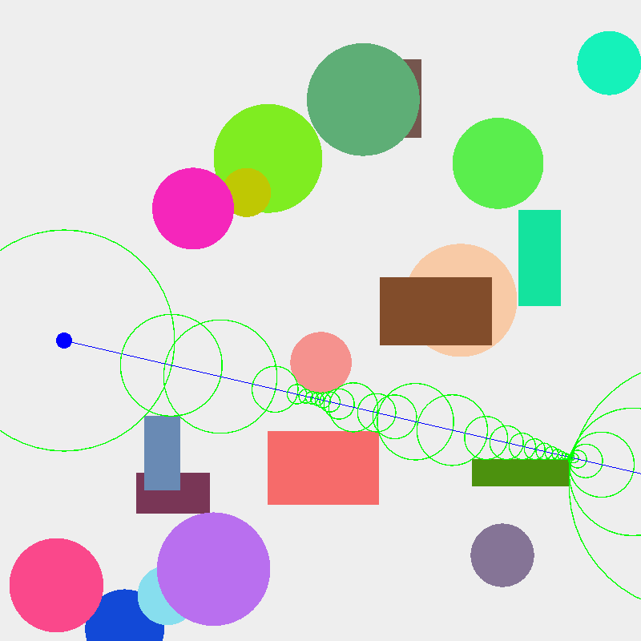

# Nifty Raymarcher

A raymarcher based on [this](http://nifty.stanford.edu/2022/crotts-matzureff-ray-marching/) nifty.
Written in C++20 with SFML.



## Dependencies

* SFML

## Build

This project was built in C++20 using [meson](https://mesonbuild.com/).
Only tested on Fedora 36 with SFML 2.5.

```shell
# clone the repo
$ git clone "https://github.com/edzdez/nifty-ray-marcher"
$ cd nifty-ray-marcher

# Generate build files
$ meson build

# Build
$ meson compile -C build
$ ./build/nifty-ray-marcher 
```